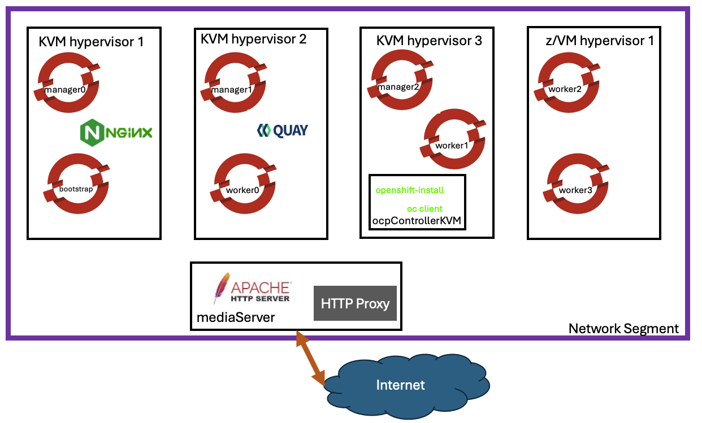
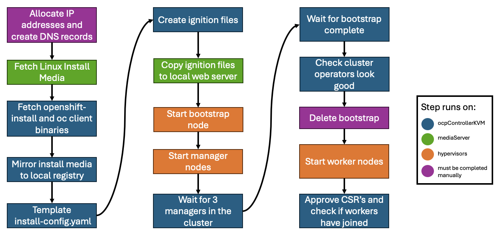

# hcit-ocp-install-automation
This repository contains automation for installing OpenShift within the HCIT environment. The goal is to be able to install OCP on LinuxOne with either z/VM or KVM.

## Warnings
1. This is very much still a work in progress. 
2. It is not expected that every aspect of these playbooks will work in every environment. Rather, some design decisions were made based on the specifics of my environment. This  repository is only meant as a proof of concept with the expectation that it will need to be modified to work properly in another environment. It is provided "AS IS", without warranty of any kind.

# Architecture Diagram
Within the HCIT environment, this is a general layout of the infrastructure used during the OCP install process. Although the diagram describes some virtual machines as being co-located on hypervisors, this need not be the case, so long as all VM's have network connectivity. Quay is used as the local image registry, Nginx is used as the loadbalancing solution and Apache is used as a web server for hosting install media and ignition files.



# OpenShift Install Process
Below is a brief diagram of the steps taken within the install-playbook Ansible playbook. 



# Usage
To install a cluster described in an inventory file:
```
ansible-playbook -i inventory/<my-inventory> install-playbook.yml
```
To uninstall a cluster described in an inventory file:
```
ansible-playbook -i inventory/<my-inventory> uninstall-playbook.yml
```
To remove the bootstrap node described in an inventory file:
```
ansible-playbook -i inventory/<my-inventory> remove-boot.yml
```

# Variables

| Variable | Usage |
| --------- | ------ |
| mediaServer | information for Ansible to connect to the machine to be used as media server. This playbook is designed for the media server to be a web server using apache |
| ocpControllerKVM | connection information for an s390x Ansible controller to be used. This is where mirroring (if required see `useLocalImages`), ignition file creation and approving node CSR's will take place |
| vlan | vlan ID for the vlan where the install will take place. It is expected that an interface like `vlan<vlanID>` (i.e. `vlan1234`) on KVM. On z/VM a `NICDEF` command will be used to VLAN tag the guests network interface |
| netmask | the netmask for the VLAN where the cluster will be installed |
| gateway | the IP address of the gateway for the VLAN where the cluster will be installed |
| dns1/dns2 | DNS server IP addresses to be used by the cluster |
| clusterName | name for the resulting cluster | 
| domain | will be combined with `clusterName` to get the cluster's |
| useLocalImages | if this variable is set to true, the OCP install container data will be mirrored to the local registry. The install-config will also point the new cluster to the local registry for it's install media. If this variable is false, the cluster will attempt to be installed using the default media sources such as `quay.io` and `registry.redhat.com` |
| enableClusterProxy | if this variable is set to true, the installed OCP cluster will be given the proxy information specified by `proxy_server` and `no_proxy`. If false, the cluster will not be proxy aware. |
| proxy_server | if `enableClusterProxy` is true, the IP address of the HTTP proxy will be passed to the installed cluster via the `install-config`. Regardless of the value of `enableClusterProxy` this information will be passed to the `ocpControllerKVM` for it to fetch the `oc` and `openshift-install` binaries and mirror images if required. |
| no_proxy | any domains or IP addresses where the proxy should not be used |
| ocpVersion | Full version info for OCP providing major, minor and patch version to be used IE 4.15.23 or 4.16.3 |
| clusterPullSecret | This should be a path from `{{ playbook_dir }}` to a dockerconfigjson with all image pull secrets to be used by the installed OCP cluster |
| vCPUs | number of virtual CPU's given to each cluster node |
| guestMem | memory in GB given to each cluster node |
| guestDisk | memory in GB given to each cluster node. There was some special handling done here to get from GB to cylinders for a z/VM install. See the note below for more info.  |
| architecture | only use s390x for now, would like to eventually add multi-arch support with s390x managers/workers + x86 workers |
| mediaServerIP | IP address of the media server |
| mediaServerDir | Directory for the apache web server, the automation will create a cluster specific directory inside this directory |
| imageRegHostName | the hostname of your local image registry |
| clusterOrgPath | where should images mirrored locally be placed in the registry |
| additionalCerts | file with all of the extra CA certificates the installed cluster should trust | 
| mirrorCredsFile | relative path from `{{ playbook_dir }}` to a dockerconfigjson file with all pull secrets needed to complete a mirror if mirroring is required. This should include pull secrets from `quay.io`, `registry.redhat.io` and a secret with write permissions to `{{ imageRegHostName }}/{{ clusterOrgPath }}` |

# Children formatting
The children section of the inventory is used to specify information specific to each node. All nodes will need an IP address and install type specified (either KVM or z/VM). The hypervisor will also need to be specified. For a KVM node, the `ansible_host` and `ansible_user` fields should be used to specify connection information for the KVM hypervisor. For a z/VM node, the `ansible_host` and `ansible_user` fields must specify a machine with SMCLI access to the desired z/VM node. All z/VM nodes will also need to specify a `guestName` which must be 8 or fewer alphanumeric characters. As currently designed, any guest on the z/VM instance with the name `guestNmae` will be deleted so ensure that either none exist or that you are ok with the guest being replaced. 


## Registry Credentials
In the inventory file, there are two vars for specifying image registry credentials. The first is `clusterPullSecretFile` which should be a dockerconfigjson file with all credentials you want the cluster to have access to. For instance, this may only need to be read-only access to a local registry's org for that cluster. The second is `mirrorCredsFile` which should only have the credentials needed for mirroring should mirroring be required. Both files should be formatted as dockerconfigjson's and use a relative path from `{{ playbook_dir }}`

# z/VM Storage
## Background
Unfortunately, there is no perfect solution for getting to cylinders from GB. To make the user experience more consistent, it seemed like a good idea to permit users to specify desired storage in GB. It's important to note that the conversion is not perfect and will need to be modified to suit local conventions or requirements. For instance, one local convention in the HCIT environment is that we try to allocate disks in multiples 10016 cylinders (a little under 7GB). This quantization of storage means that users will probably not end up with exactly the amount of storage they request. The logic implemented here will round up. For example, if a user requests 18GB, they'll end up with about 20.3GB. This choice was made such that a user's minimum requirements should be met/exceeded, even if the user only requests the minimum. 
## How it works
The first step was getting an estimate of the conversion factor from some exisiting z/VM guests. I used `vmcp q v dasd` to get a list of a guests disks which included the number of cylinders on a given disk. I then used `fdisk -l` to retrieve the size of the same disk in bytes. 
The first guest I checked had 20.6 GB disk and used 30048 cylinders.
```
22153789440 B / 30048 cyl = 737280 
```
The second guest had 123.8 GB and used 180288 cylinders
```
132922736640 B / 180288 cyl = 737280
```
Cool, I got the same conversion factor for both. Again, this factor may be different in other environments, this was just what I was able to determine in the HCIT environment.
With the conversion factor, we can now start to automate the process of getting the right disk size.
Getting the right disk size starts with calculating the minimum number of cylinders the user wants:
```
minimumNumberOfCylinders = ( requestDiskInGB / 737280 ) * bytesPerGB
```
Then, it's time to calculate how many chunks of 10016 cylinders we would need to get the minimum number of cylinders:
```
numberOfChunks = minimumNumberOfCylinders / 10016
```
I then chose to round the number of chunks up to the next integer so that the user always gets at least as much storage as they request, but you could also round down here to save some extra disk.
```
roundedChunks = ceil(numberOfChunks)
```
Lastly, we get the total number of cylinders to request by multiplying the rounded number of chunks by 10016.
```
numCylinders = roundedChunks * 10016
```

# z/VM Ansible
When working with z/VM clusters, these playbooks use the zvm_ansible_collection available [here](https://github.com/IBM/zvm_ansible_collection). The readme of the zvm ansible collection repository provides instructions for installation. Additionally, I found [this repository](https://github.com/IBM/zvm_ansible) with samples useful while writing this automation.
During my work on these playbooks, I found it useful to define the install location of the z/VM Ansible collection inside an `ansible.cfg` within the library stanza:
```
...
# (pathspec) Colon-separated paths in which Ansible will search for Modules.
library=/Users/<username>/.ansible/plugins/modules:/usr/share/ansible/plugins/modules:/Users/<username>/<path>/<to>/zvm_ansible_collection
...
```
# Registry Credentials
To add a registry to a credential file, it may be useful to use `podman login --authfile=<file to add creds to> my.new.registry.io` to add the correct credentials to a given file such as `mirror.dockerconfigjson` or a cluster's dockerconfigjson.

#### Copyright IBM Corporation 2024